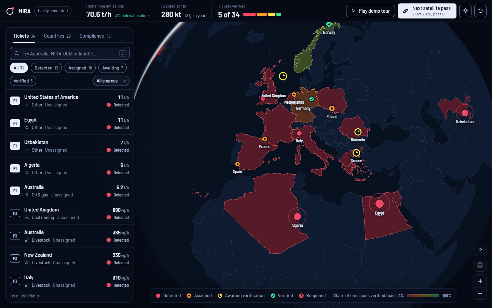
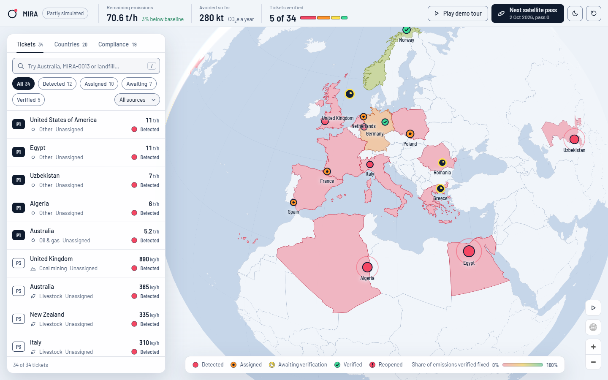

# MIRA: Methane Incident Response & Action

Front-end prototype for Climate Hack-tion, track **Zero Waste & Methane Reduction**.

Satellites already detect methane plumes. This desk turns each detection into a ticket: the **likely source**, the **climate impact**, the **best fix**, and a **satellite check that the fix worked**. A hotspot only turns green when a later satellite pass confirms the plume dropped. Countries shift from red to green as verified fixes add up.





**The incidents come from the team's database** (`src/backend`): on a local page the front end reads `GET /incidents` from the FastAPI server; anywhere else, or when the server isn't running, it shows `data.js`, a saved copy of the same database seed. Today that is 30 synthetic incidents in Europe, Australia and the Pacific, with fictional operators, plus four real, unattributed satellite detections from SRON's public Sentinel-5P data (in the United States, Egypt, Uzbekistan and Algeria), so the header says "Partly simulated". Each synthetic ticket is marked "Simulated detection". The table of fixes and their costs is invented. See "Live data from the API" below.

## Run it

- With the database: start the backend as its README says (`docker compose up -d`, then `uvicorn src.backend.main:app --reload` from the repo root), then serve this folder on port 5173, which the backend's CORS list allows: `npx http-server src/frontend -p 5173` from the repo root, and open `http://localhost:5173`.
- Without it: double-click `index.html`, or serve the folder the same way with the backend stopped. No install, no build step. It shows the saved copy of the database.
- To publish: GitHub Pages serves only a branch's root or its `docs/` folder, so publish this folder with a Pages workflow that uploads `src/frontend`, or copy it to the root of a `gh-pages` branch. A public page cannot reach a server on your machine, so it shows the saved copy.

Click **Play demo tour** for a 90-second scripted walk-through (written as narration for a 2-minute video); it starts from a fresh demo state each time. **Reset** (top right) restores the starting state.

The **sun and moon button** next to Reset switches the whole screen, map included, between night (the default) and day. The choice is remembered in that browser, and `?theme=light` or `?theme=dark` on the address opens a link in either.

Keyboard: `/` search, `j` and `k` next and previous ticket, `Esc` close. The map has a pause-motion button; touching the globe pauses it too (the button switches to play), and it follows the system reduced-motion setting. Run `MRS.check()` in the browser console to test the ticket rules.

## How a ticket moves

| Status | Dot on the map | What happens |
|---|---|---|
| Detected | red, solid | New and unassigned. The regulator picks a fix and an operator, and the deadline starts. |
| Assigned | orange, dark centre | The operator works through an on-site checklist for that kind of site (5 checks for oil and gas, 4 or 5 for the others) and records the broken component, with a short report and, optionally, a ground-sensor reading. The fix can only be logged once the source is found. |
| Awaiting verification | yellow ring with a wedge | The fix is logged. Nothing counts yet. |
| Verified | green with a check | A clear satellite pass shows the plume at least 70% below its baseline. |
| Reopened | red with `!` | The pass shows less than a 70% drop. The ticket needs a new fix. |

Shape carries the state, colour reinforces it. The four colours mean ticket status and nothing else; the country shading has its own red-to-green ramp and counts verified reductions only. Clouds can block a pass, so a ticket may wait for the next one.

Once a fix is logged, the Verification step lists three sources: the operator's report (a claim), the ground sensor (supports) and the satellite (decides). When the sensor and the satellite disagree, the ticket says so. A ticket past its deadline is marked Overdue and moves to the top of its group in the list.

## Compliance and the evidence trail

The **Compliance** tab groups tickets by operator, or by assignee when the data names no operator, with how many are overdue or reopened and the share on track (past detection, neither overdue nor reopened). Clicking a named row lists its tickets. **Download evidence trail (CSV)** saves one line per logged event for every ticket, with the source found, the checks done, the operator's report and the sensor reading on each line; cells that start with `=`, `+`, `-` or `@` are prefixed so a spreadsheet does not run them.

## Data contract

This is the shape the app reads. The database rows are converted to it by `api.js` (next section); other data can be loaded at runtime with `MRS.load(json)`. Dates are ISO 8601 strings. Rates are kg of methane per hour.

```jsonc
{
  "meta": { "asOf": "2026-10-03T08:00:00Z", "version": "2026-10-03", "placeholder": false, "simulated": false },
  "hotspots": [{
    "id": "MIRA-0129",                // unique ticket id
    "lat": 39.8, "lon": 55.0,
    "iso": "TKM",                     // ISO 3166-1 alpha-3, must exist in countries.js
    "country": "Turkmenistan", "region": "Balkan region",
    "sector": "oil_gas",              // oil_gas | coal | landfill | wastewater | livestock (anything else shows as Other)
    "detectedAt": "2026-09-28T01:00:00Z",
    "rateKgH": 38200,                 // baseline emission rate
    "uncertaintyKgH": 4600,           // optional, plus or minus
    "persistence": 0.8,               // optional, 0 to 1: share of passes where the plume is seen (default 0.5)
    "satellite": "Sentinel-5P", "operator": "Meridian Midstream",
    "source": {                       // optional: the attribution
      "name": "Compressor station 4", "confidence": 0.71,
      "alternatives": [{ "sector": "coal", "confidence": 0.17 }],
      "evidence": "Plume origin sits 156 m from a mapped compressor station."
    },
    "passes": [                       // optional: observations. rateKgH null = no valid reading (cloud)
      { "date": "2026-09-28T01:00:00Z", "rateKgH": 38200 },
      { "date": "2026-10-01T10:36:00Z", "rateKgH": null, "note": "cloud" }
    ],
    "ticket": {                       // optional: workflow state that already exists
      "status": "new",                // new | assigned | fixed | verified | reopened
      "priority": null, "assignee": "", "fixId": "", "assignedAt": null, "fixAt": null,
      "events": [{ "t": "2026-09-28T01:00:00Z", "text": "Detected by Sentinel-5P at 38.2 t/h" }],
      "passes": []                    // observations made after the fix: this is where real verification data goes
    }
  }],
  "interventions": {                  // indicative fixes per sector; cost is USD thousands [low, high]
    "oil_gas": [{ "id": "flare", "name": "Route vent gas to an enclosed flare", "reduction": 0.95, "cost": [100, 300],
                  "weeks": 4, "reliability": 0.88, "minKgH": 1500, "maxKgH": null }]
  }
}
```

Only `id`, `lat`, `lon`, `iso`, `country`, `sector`, `detectedAt` and `rateKgH` are required. Everything else has a sensible default, with one exception: without `interventions` a ticket has no fix to choose and cannot be dispatched, so keep the table from `data.js` until you have real ones. With no `passes`, the detection itself is plotted as the first reading. Free text is escaped before it is shown.

## Live data from the API

The backend's `GET /incidents` returns a list of rows. `api.js` turns them into the shape above. Nothing needs setting up on the front end:

1. `config.js` points local pages (`localhost`, `127.0.0.1`) at `http://localhost:8000` and leaves every other host on `data.js`. On a local page `?api=http://host:port` overrides it; on any other host that parameter is ignored, so a shared link cannot swap the data.
2. The backend allows the page's origin through its `CORS_ORIGINS` setting, which includes `http://localhost:5173` by default. Serve the page from another origin (`http://127.0.0.1:5173`, another port) and that origin has to be added there, or the browser blocks the request. A page served over https can only call an https API.
3. If the API cannot be reached, the page shows `data.js` and says so in a message (on Windows it takes about 2 seconds to give up on a stopped server).

`data.js` keeps both seeds as raw `GET /incidents` rows and goes through the same adapter, so offline and live look the same. When a seed changes, run `node src/frontend/tools/seed-to-data.js` from the repo root to regenerate it; the table of fixes is kept.

How each field is read:

| API field | Used as |
|---|---|
| `id` | ticket id, `MIRA-0007` for 7 |
| `latitude`, `longitude` | position. The country comes from the coordinates, so the API needs no country field. A point at sea gets the nearest coast within about 500 km, otherwise "Open sea" |
| `detected_at`, `emission_rate_kg_hr` | detection time and baseline rate. A row with a rate of 0 is skipped |
| `source_type`, `sector` | source type (oil and gas, coal, landfill, wastewater, livestock, other), matched on words such as `coal` or `landfill`. `source_type` is read first because it is more specific, so `coal_seam_gas_field` is oil and gas and `wastewater_plant` is wastewater; only coal counts as coal, so `iron_ore_mine` is Other. `source_type` also names the source |
| `confidence` | source confidence, 0 to 1 (a percentage also works) |
| `severity` | priority: critical P1, high P2, medium P3, low P4 |
| `status` | red: `detected`, `awaiting_review`. Orange: `investigating`, `action_assigned`. Yellow: `repair_in_progress`, `awaiting_verification`. Green: `resolved`. Matched on words, so other spellings (`unassigned`, `verified`, `closed`) also work |
| `satellite_source`, `location_uncertainty_m` | satellite name; "within 250 m" under Location |
| `is_real` | `false` marks a simulated detection, and the header then says the data is partly simulated |
| `operator` (or `operator_name`), `facility_name` | the operator fills "Registered operator", is offered as the assignee and is the row the Compliance tab counts against; the facility name leads the source, for example "LNG train 2 (LNG facility)". Empty for the real detections, which arrive unattributed |
| `emission_rate_uncertainty_kg_hr` | "plus or minus" next to the rate |
| `data_source` | where a real detection comes from, shown under the source with the credit its licence asks for |

A real detection (`is_real: true`) is never touched by the simulated satellite pass, and the demo tour only acts on synthetic tickets, so no invented reading or fix is ever shown on real data.

Not in the API, so assumed: region (left blank), persistence (0.5), readings after a fix (none) and the list of fixes (taken from `data.js`). A row the API calls verified but gives no reading for counts at the 70% target, and its ticket says so. Assigning, logging a fix and running a satellite pass still happen in the browser only and are lost on reload, because the database is the truth; saving them needs the write-back described below. Run `MRS_ADAPT.check()` in the console to test the field rules.

**What the UI works out itself**, so the backend does not have to: priority (P1 to P4, from rate times persistence), the due date (7, 14, 30 or 60 days by priority, counted from the assignment, or from the detection for a ticket that arrives already assigned with no date), overdue tickets and their place in the list, the per-operator compliance figures, climate impact (IPCC AR6 warming factors, with a car equivalent), the ranked list of fixes, and each country's share of emissions verified fixed.

**What is simulated today** and needs real wiring:

- `advancePass()` in `app.js` invents satellite readings. Real readings should arrive as `ticket.passes` entries after `fixAt`, and `meta.simulated: false` hides the simulate button.
- `dispatch()` and `logFix()` change state in the browser only (saved to `localStorage` for the offline copy, dropped on reload for live data). The backend already has `PATCH /incidents/{id}` for `status` and `severity`, but its CORS rule allows `GET` only, so a browser cannot call it yet. To write back: the backend adds `PATCH` to `allow_methods` in `src/backend/main.py`, then `dispatch()` sends `action_assigned` and `logFix()` sends `awaiting_verification`.
- "Log fix as applied" stands in for the operator's report, and the inspection checks, report and ground-sensor reading are typed in on the regulator's screen. In production they arrive from the operator's own app and from sensors on site. A ticket that arrives from the database with its fix already reported is treated as reported when the data was loaded, since the database has no fix date.

## Files

| File | What it is |
|---|---|
| `index.html`, `styles.css`, `app.js` | The app. Plain HTML, CSS and JavaScript, no framework. |
| `tour.js` | The demo tour. Delete it and its script tag to drop the tour. |
| `data.js` | The saved copy of the database seed, and the table of fixes. Regenerated by `tools/seed-to-data.js`. |
| `config.js`, `api.js` | The API address, and the adapter from `GET /incidents` rows to the data contract. |
| `tools/seed-to-data.js` | Rebuilds the rows in `data.js` from the backend seed. Node.js, run by hand. |
| `countries.js` | Country shapes, generated from Natural Earth (trimmed to name and ISO code). The overseas regions of France (French Guiana, Guadeloupe, Martinique, Réunion, Mayotte), the Caribbean Netherlands and Tokelau are split into their own shapes, so a ticket in mainland France does not shade South America. |
| `vendor/`, `fonts/` | MapLibre GL JS and the typefaces, self-hosted so it runs offline. |

## Design notes

- **Colour means ticket status, nothing else.** The interface is neutral. Red, orange, yellow and green appear only for ticket state; the country shading has its own ramp. Source type, priority and everything else use icons, weight and words.
- **Colour is never alone.** Every status has a shape (solid dot, dot with a dark centre, ring with a wedge, check, exclamation mark) and a label, so it reads without colour vision.
- **Night and day are one set of tokens.** `styles.css` holds every colour twice, the `:root` block for night and `[data-theme='light']` for day, and `app.js` reads them back for the map, so nothing else differs between the two. The four status colours do not change: on a light surface yellow and green cannot reach 3:1 by themselves, so each status shape gets a thin dark outline and a dark glyph instead, and green as text uses a deeper green.
- **Verification is the point.** Most dashboards stop at "detected". Here a fix counts only after a satellite confirms it, and fixes can fail.
- Typeface: Barlow and Barlow Semi Condensed, a signage family that suits a dispatch desk.

## Quality checks

Lighthouse 13.5, run in night and day on desktop and mobile: accessibility 100 and SEO 100 every time. Best practices scored 78 on a plain-http test server, and the only failures were "uses HTTPS", "redirects HTTP to HTTPS" (no local server passes those) and "valid source maps" (the vendored MapLibre ships none); an HTTPS deployment was not measured. Unthrottled load in headless Chrome with software rendering: LCP typically 110 to 220 ms (the "Loading the map…" label counts as content; a cold first load took 2.7 s), CLS 0.04, and the globe itself ready after 3 to 6 s here (about 1.3 s on a laptop with a GPU). Measured contrast: body text 16.3:1, muted text 6.2:1, status marks 4.8:1 or better, control outlines 4.3:1. The four status colours pass a colour-blind separation check (worst neighbouring pair ΔE 11.1 for colour-blind viewers, 18.1 for full colour; the red leans crimson so it stays apart from the orange). The country fill ramp does not separate amber from green well for deuteranopia (ΔE 5), so the percentage is always given in words as well: in the map tooltip and in the Countries tab.

Day mode, measured the same way: ink 17.3:1, secondary text 8.9:1, muted text 5.2:1 or better, green text 5.4:1, control outlines 3.4:1 or better, the dark glyph on each status disc 4.9:1 or better, the ring round a map marker 11:1 or better against the map. An audit of the rendered text (ticket, countries and compliance tabs, and with a ticket open) found nothing under 4.5:1, or 3:1 for large text, in either theme, and axe-core reported no violations in either.

Checked at 320, 360, 375 and 390 px wide (phone), 844 × 390 (phone sideways), 881 to 1161 px (the header, which is the tightest part), 1024, 1280, 1440 and 1920 px, and over `file://`. On touch screens every control has a 44 px target except the sheet handle (32 px) and the chart points (27 px; the table under the chart lists the same readings).

Known limits: the theme is chosen by the button and the saved choice, not by the system setting (night is the default); type is sized in px, so the browser's default font-size setting is ignored (zoom works); phones show no map key (the status shapes are named in each ticket row and the shading scale is in the Countries tab); a phone held sideways gets a scrolling sheet and a thin strip of map; the single-key shortcuts (`/`, `j`, `k`) are always on; the map needs WebGL (the ticket list works without it); no accounts or roles; Natural Earth shows de facto borders and this prototype takes no position on disputed ones.

## Tools, datasets and AI used (for the submission form)

- **MapLibre GL JS 5.19.0**, BSD-3-Clause, in `vendor/`.
- **Natural Earth 1:50m admin-0 countries**, public domain, from `github.com/nvkelso/natural-earth-vector`. Trimmed and rounded to 0.01 degrees to make `countries.js`.
- **Barlow** and **Barlow Semi Condensed**, SIL Open Font License 1.1, from the Fontsource npm packages (latin subset, self-hosted).
- **Methane warming factors**: IPCC AR6, 100-year 29.8 (fossil) and 27.0 (non-fossil), 20-year 82.5 and 79.7. **Car equivalent**: 4.6 t CO2e a year for a typical passenger car (US EPA).
- **Incident data**: the team's synthetic demo seed in the backend database (incidents, operators and facilities are fictional), plus four detections from **SRON's weekly methane plume data** (TROPOMI on Copernicus Sentinel-5P), CC BY 4.0: product generation by the SRON team (earth.sron.nl/methane-emissions/), Schuit et al. (2023), https://doi.org/10.5194/acp-23-9071-2023, contains modified Copernicus Sentinel-5P data. **Fix costs**: invented for this prototype.
- **AI**: the code, copy and this README were written with Claude Code (Claude Sonnet 5.5, Anthropic). Chrome DevTools and Lighthouse were used for testing, and Node.js to prepare the asset files.
